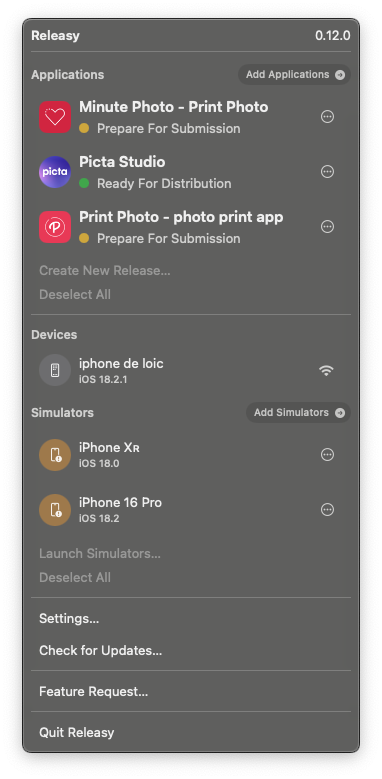

## Releasy: Simplify Your App Testing and Releases
Releasy is the ultimate companion for small teams and indie developers creating iOS and iPadOS apps. Designed with simplicity and efficiency in mind, Releasy streamlines two of the most crucial steps in the development lifecycle: testing and releasing your app.

### Key Features

**Effortless Testing:** Instantly test your app's pull requests on physical devices or simulators with just a few clicks. No more juggling configurations or complex setup—Releasy handles it all for you.

**One-Click App Store Releases:** Ready to share your app with the world? Releasy simplifies the entire release process, letting you publish to the Apple Store effortlessly. Say goodbye to tedious workflows and hello to streamlined success.

**Indie Dev Friendly:** Built specifically for small teams and independent developers, Releasy helps you focus on what truly matters **—creating great apps—** while we take care of the tedious technical details.

### Why Choose Releasy?

**Save Time:** Automate repetitive tasks so you can spend more time coding and creating.

**Reduce Errors:** With Releasy's guided workflows, you can avoid common pitfalls during testing and releases.

**Stay Agile:** Whether you’re testing on the latest iPhone or preparing a major update for the Apple Store, Releasy adapts to your workflow seamlessly.

Take the hassle out of testing and releasing apps. With Releasy, you can bring your ideas to life faster, smoother, and with total confidence.

**Start using Releasy today and focus on building apps—not managing workflows.**

### How it looks like?

